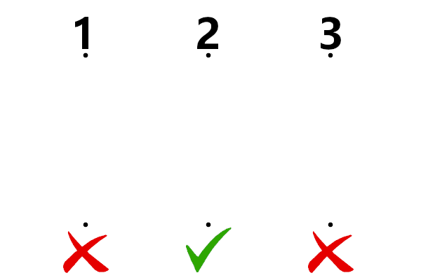

# Egunean Behin Lehiaketa

## **Sarrera**
Hasierako helburua, egunean behin-eko figuren ideiaren antzeko zerbait sortzea izan zen. Haien artean nahasten diren 3 bidez osatutako eta bide zuzen bakarra izango duen irudiak sortzen dituen programa bat. Hasieratik Processing erabiltzea erabaki nuen.

Processing, arte bisualak bultzatzeko sortutako ingurune bat da eta Java programazio lenguaia erabiltzen du. Lan honen garapenerako oso baliagarria izan da, irudiak gutxinaka zer itxura hartzen duen ikusi daitekelako.

## **Processing instalatu**
Beharrezkoa izango da Processing instalatzea gure ekipoan, kodigoa exekutatzeko. Ez dugu beste ezer beharko.

Processing-en orrialde ofizialetik egin ahalko dugu hori. [Processing Download](https://processing.org/download/)

.ZIP luzapeneko artxibo bat deskargatuko zaigu, hau deskonprimatu besterik ez dugu egin beharko. Kodigoa duen artxiboa processing.exe programarekin ireki beharko dugu.

## **Programaren Logika**
Hasieran, irudi bat kargatzen da, 'data' karpetan dagoena. 1, 2 eta 3 zenbakiak ditu goialdean, eta irudiaren behekaldean bi ixa gorri eta tick berde bat azaltzen dira. Hauen artean bide bana lotzen da, ausazko formez osatuta. Zenbaki bakoitza zein ikonorekin lotzen den ere ausaz erabakitzen da. Bukaeran irudia eta haren informazioa gordetzen dira. Hona hemen irudiaren adibide bat: 

Programaren funtzionaltasuna hainbat ataletan banatzen da.

### **1.** setup()
Processing-en, funtzio hau hasieran, beste guztiaren aurretik exekutatzen da, behin soilik. Hemen Canvas-aren dimentsioak ezartzen dira eta hasierako irudia kargatzen da. Csv artxiboaren goiburuko kanpo bakoitza ere hemen definitzen da.

### **2.** draw()
draw() funtzioa etengabean exekutatzen da Processing-en. Hemen sartuko dugu gainontzeko kodigoa. Hasieran while bat daukagu. Buelta bakoitzean, Canvas-a berrabiarazten du eta hasierako irudia berriro ezarri.

Bide bakoitzak 5 puntu izango ditu, hauek Array bidimentsional baten gordeko dira. Lehen puntua eta azkena, ezarrita daude, beraz ez dira kalkulatu behar, tarteko 3 puntuak kalkulatu behar dira bakarrik. Hau Random() funtzioa erabiliz egingo dugu.

### **3.** Puntu bakoitzeko X eta Y
Irudiko ibilbideak osatuko dituzten puntuak kalkulatzerako orduan, ausaz egin arren, haien artean distantzia zehatz bat mantentzen dute, bideak ulergarriak izan daitezen. Azkenengo ezarri dugun puntua erreferentziatzat hartuta, bi puntuen X eta Y ardatzen balioaren artean pixel batzuetako diferentzia uzten da.

### **4.** Bide bakoitzeko azkenengo puntuak
Bide bakoitzeko lehen 4 puntuak zeintzuk diren dakizkigunean, bide bakoitza ausaz azken puntu batekin lotuko da. Horrekin, irudi bakoitzean erantzuna ezberdina izatea lortzen dugu.

### **5.** Marrak marraztu
Behin puntu guztiak ezarrita daudenean, haien artean marrak marraztuko ditugu, Processing-ek eskaintzen digun funtzio batekin. bezier() erabiltzean puntuen artean kurbak sortzen dira, marra zuzenen ordez.

### **6.** Irudak / Csv gorde
Irudia osatuta dagoenean eta erantzuna zein erantzun okerrak zeintzuk diren dakigunean, irudiaren izena ausazko zenbaki batzuekin erabakiko dugu. Irudia 'irudiak' karpetan gordeko da eta sortuta ez badago automatikoki sortuko da. Irudi horren informazioa csv artxiboan gordeko da, berriz ere, artxiboa ez badago sortuta, automatikoki sortuko du programak.

## **Oharrak**
### **1.** Irudi asko
Irudi asko sortu nahi badira, programak ez du biderik ez ezer erakusten denak gorde arte, beraz izan pazientzia.

### **2.** Csv artxiboa
Csv artxiboa ezabatu eta berriro sortzen da programa berriro exekutatu ezkero. Irudiek izen ezberdina edukiko dute eta denak gordeko dira, baina Csv artxiboaren izena aldatu ezean ez da gordeko.